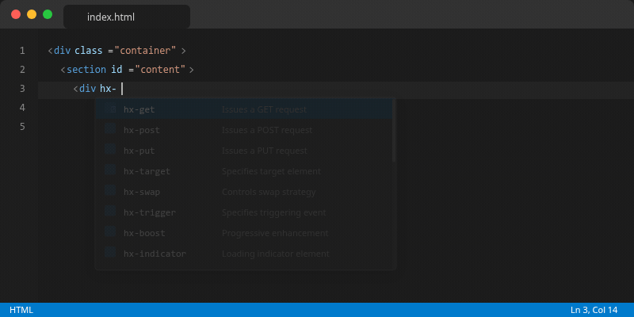
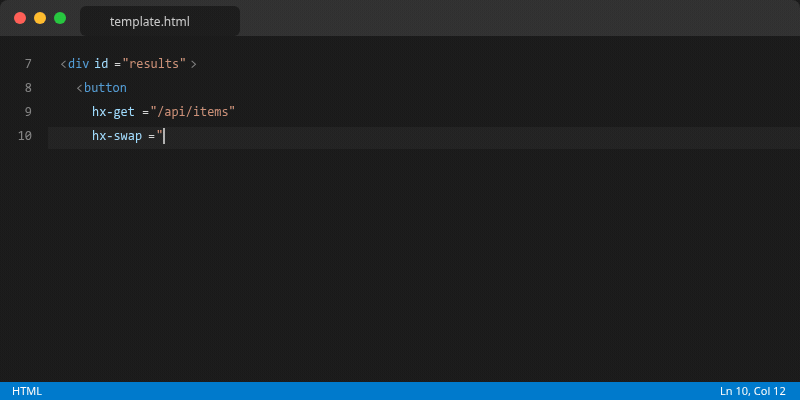
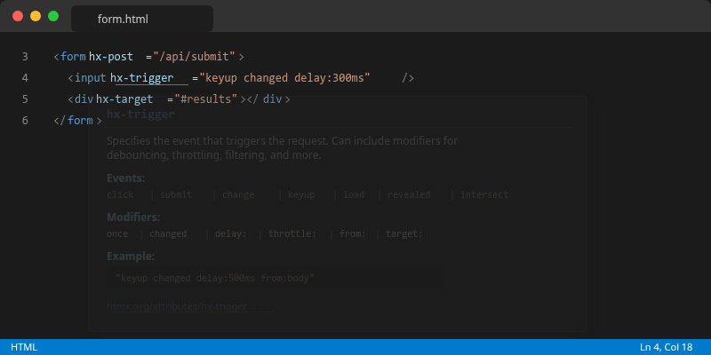
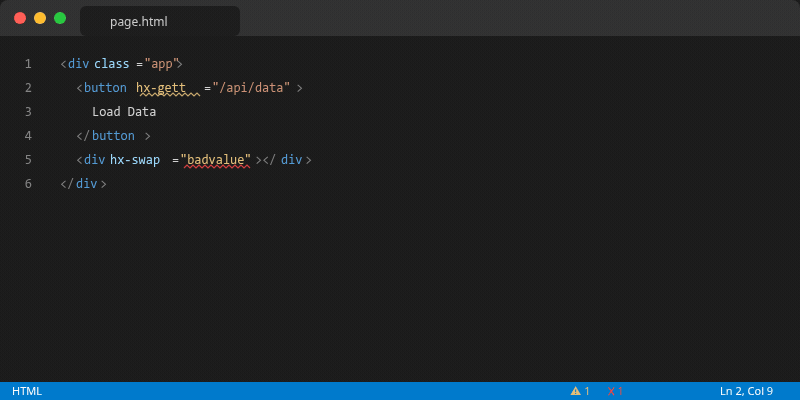

<p align="center">
  
</p>

<p align="center">
  <strong>Complete HTMX development toolkit: IntelliSense, hover docs, validation, diagnostics, and snippets for 20+ template languages.</strong>
</p>

<p align="center">
  <a href="https://marketplace.visualstudio.com/items?itemName=andreahlert.htmx-vscode-toolkit">
    
  </a>
  <a href="https://marketplace.visualstudio.com/items?itemName=andreahlert.htmx-vscode-toolkit">
    
  </a>
  <a href="https://marketplace.visualstudio.com/items?itemName=andreahlert.htmx-vscode-toolkit">
    
  </a>
  <a href="https://github.com/atoolz/htmx-vscode-toolkit/blob/main/LICENSE">
    
  </a>
  
</p>

<br>

## Features

### Attribute Completions

> Smart completions for all 27+ `hx-*` attributes with documentation and correct insert formatting.

<p align="center">
  
</p>

### Context-Aware Value Completions

> Get value suggestions based on the attribute you're editing. Supports `hx-swap` strategies, `hx-trigger` events and modifiers, `hx-target` selectors, `hx-ext` extensions, and more.

<p align="center">
  
</p>

### Hover Documentation

> Hover over any `hx-*` attribute to see a rich tooltip with description, valid values, modifiers, examples, and a link to official HTMX docs.

<p align="center">
  
</p>

### Diagnostics & Validation

> Catch typos and invalid values before they reach the browser. Includes Levenshtein-based "did you mean?" suggestions and deprecated attribute warnings.

<p align="center">
  
</p>

### 20+ Template Languages

Works everywhere HTMX is used:

| Language | Extensions |
|----------|-----------|
| HTML | `.html` |
| PHP / Blade | `.php`, `.blade.php` |
| Django / Jinja2 | `.html` (Django), `.jinja`, `.jinja2`, `.j2` |
| Go Templates / Templ | `.gohtml`, `.tmpl`, `.templ` |
| JSX / TSX | `.jsx`, `.tsx` |
| Astro | `.astro` |
| Svelte | `.svelte` |
| Vue | `.vue` |
| ERB (Ruby) | `.erb` |
| Twig | `.twig` |
| Handlebars | `.hbs` |
| EJS | `.ejs` |
| Nunjucks | `.njk` |
| Razor | `.cshtml` |
| Pug | `.pug` |

### Snippets

23 ready-to-use patterns:

| Prefix | Description |
|--------|-------------|
| `hx-get` | GET request with target |
| `hx-post-form` | Form with POST |
| `hx-infinite-scroll` | Infinite scroll pattern |
| `hx-search` | Live search |
| `hx-sse` | Server-Sent Events |
| `hx-ws` | WebSocket connection |
| `hx-lazy` | Lazy loading |
| `hx-delete-confirm` | Delete with confirmation |
| `hx-poll` | Polling pattern |
| `hx-click-to-edit` | Click-to-edit |
| `hx-boost-nav` | Boosted navigation |
| `hx-modal` | Modal dialog |
| `hx-file-upload` | File upload with progress |
| `hx-dependent-dropdown` | Cascading dropdown |
| `hx-oob-swap` | Out-of-band swap |
| `hx-table-row` | Table row with inline editing |
| `hx-progress` | Progress bar with polling |
| `hx-tabs` | Tab navigation |
| `hx-toast` | Toast notification via OOB |
| `hx-form-validation` | Form with inline validation |
| `hx-template` | Full HTML page boilerplate |
| `hx-active-search` | Active search with debounce |
| `hx-bulk-actions` | Bulk actions with checkboxes |

<br>

## Installation

**VS Code Marketplace:**

1. Open VS Code
2. Press `Ctrl+Shift+X` (or `Cmd+Shift+X` on macOS)
3. Search for **"HTMX Toolkit"**
4. Click **Install**

**Command Line:**

```bash
code --install-extension andreahlert.htmx-vscode-toolkit
```

<br>

## Configuration

| Setting | Default | Description |
|---------|---------|-------------|
| `htmxIntelliSense.enableCompletion` | `true` | Enable attribute completions |
| `htmxIntelliSense.enableHover` | `true` | Enable hover documentation |
| `htmxIntelliSense.enableValidation` | `true` | Enable diagnostics/validation |

<br>

## Why This Extension?

HTMX has **47K+ GitHub stars** and is one of the fastest-growing frontend libraries. Yet the VS Code tooling ecosystem is fragmented: 6+ extensions, none comprehensive, none supporting template languages properly.

**HTMX Toolkit** fills this gap with:
- The most complete attribute and value completion available
- Real validation with typo detection (not just syntax highlighting)
- First-class support for server-side template languages (Go, Python, PHP, Ruby)
- Clean, maintainable data layer that tracks HTMX releases

<br>

## Contributing

Contributions welcome! Please see [CONTRIBUTING.md](CONTRIBUTING.md) for guidelines.

```bash
# Clone and install
git clone https://github.com/atoolz/htmx-vscode-toolkit.git
cd htmx-vscode-toolkit
npm install

# Build and test
npm run build
npm run test:e2e

# Debug in VS Code
# Press F5 to launch Extension Development Host
```

<br>

## License

[MIT](LICENSE)

---

<p align="center">
  <sub>Built for the HTMX community</sub>
</p>
